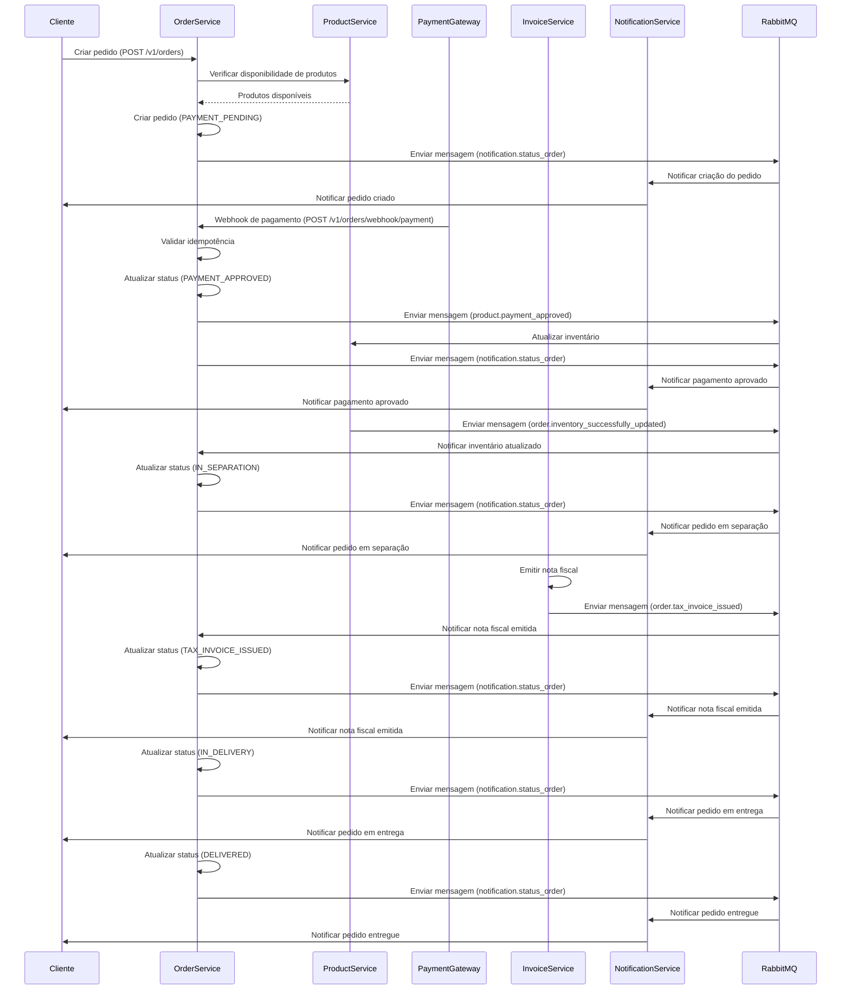
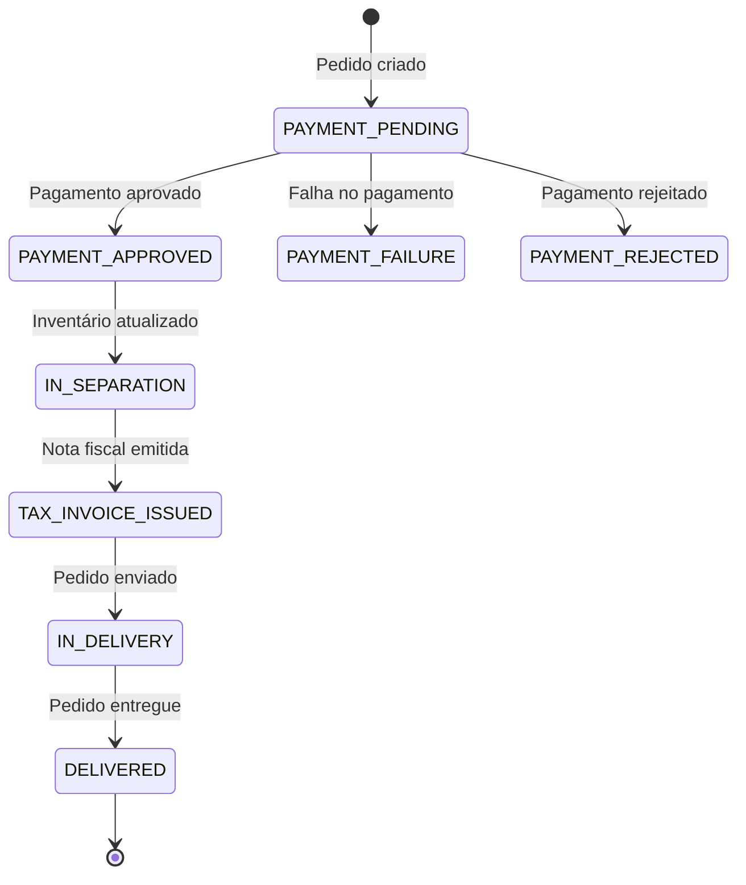
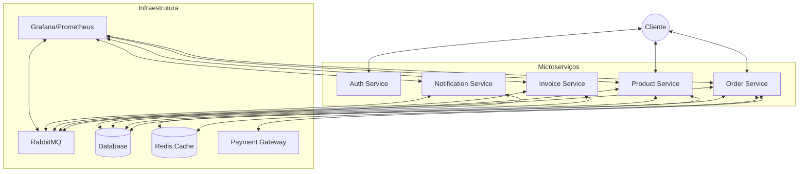

# Diagrama de Fluxo de Processamento de Pedidos

```mermaid
sequenceDiagram
    participant Cliente
    participant OrderService
    participant ProductService
    participant PaymentGateway
    participant InvoiceService
    participant NotificationService
    participant RabbitMQ
    
    Cliente->>OrderService: Criar pedido (POST /v1/orders)
    OrderService->>ProductService: Verificar disponibilidade de produtos
    ProductService-->>OrderService: Produtos disponíveis
    OrderService->>OrderService: Criar pedido (PAYMENT_PENDING)
    OrderService->>RabbitMQ: Enviar mensagem (notification.status_order)
    RabbitMQ->>NotificationService: Notificar criação do pedido
    NotificationService->>Cliente: Notificar pedido criado
    
    PaymentGateway->>OrderService: Webhook de pagamento (POST /v1/orders/webhook/payment)
    OrderService->>OrderService: Validar idempotência
    OrderService->>OrderService: Atualizar status (PAYMENT_APPROVED)
    OrderService->>RabbitMQ: Enviar mensagem (product.payment_approved)
    RabbitMQ->>ProductService: Atualizar inventário
    OrderService->>RabbitMQ: Enviar mensagem (notification.status_order)
    RabbitMQ->>NotificationService: Notificar pagamento aprovado
    NotificationService->>Cliente: Notificar pagamento aprovado
    
    ProductService->>RabbitMQ: Enviar mensagem (order.inventory_successfully_updated)
    RabbitMQ->>OrderService: Notificar inventário atualizado
    OrderService->>OrderService: Atualizar status (IN_SEPARATION)
    OrderService->>RabbitMQ: Enviar mensagem (notification.status_order)
    RabbitMQ->>NotificationService: Notificar pedido em separação
    NotificationService->>Cliente: Notificar pedido em separação
    
    InvoiceService->>InvoiceService: Emitir nota fiscal
    InvoiceService->>RabbitMQ: Enviar mensagem (order.tax_invoice_issued)
    RabbitMQ->>OrderService: Notificar nota fiscal emitida
    OrderService->>OrderService: Atualizar status (TAX_INVOICE_ISSUED)
    OrderService->>RabbitMQ: Enviar mensagem (notification.status_order)
    RabbitMQ->>NotificationService: Notificar nota fiscal emitida
    NotificationService->>Cliente: Notificar nota fiscal emitida
    
    OrderService->>OrderService: Atualizar status (IN_DELIVERY)
    OrderService->>RabbitMQ: Enviar mensagem (notification.status_order)
    RabbitMQ->>NotificationService: Notificar pedido em entrega
    NotificationService->>Cliente: Notificar pedido em entrega
    
    OrderService->>OrderService: Atualizar status (DELIVERED)
    OrderService->>RabbitMQ: Enviar mensagem (notification.status_order)
    RabbitMQ->>NotificationService: Notificar pedido entregue
    NotificationService->>Cliente: Notificar pedido entregue
```

# Diagrama de Estados do Pedido

```mermaid
stateDiagram-v2
    [*] --> PAYMENT_PENDING: Pedido criado
    PAYMENT_PENDING --> PAYMENT_APPROVED: Pagamento aprovado
    PAYMENT_PENDING --> PAYMENT_FAILURE: Falha no pagamento
    PAYMENT_PENDING --> PAYMENT_REJECTED: Pagamento rejeitado
    PAYMENT_APPROVED --> IN_SEPARATION: Inventário atualizado
    IN_SEPARATION --> TAX_INVOICE_ISSUED: Nota fiscal emitida
    TAX_INVOICE_ISSUED --> IN_DELIVERY: Pedido enviado
    IN_DELIVERY --> DELIVERED: Pedido entregue
    DELIVERED --> [*]
```

# Diagrama de Arquitetura

```mermaid
flowchart TB
    Cliente((Cliente))
    
    subgraph Microserviços
        AuthService[Auth Service]
        OrderService[Order Service]
        ProductService[Product Service]
        InvoiceService[Invoice Service]
        NotificationService[Notification Service]
    end
    
    subgraph Infraestrutura
        RabbitMQ[RabbitMQ]
        Database[(Database)]
        Redis[(Redis Cache)]
        PaymentGateway[Payment Gateway]
        Grafana[Grafana/Prometheus]
    end
    
    Cliente <--> AuthService
    Cliente <--> OrderService
    Cliente <--> ProductService
    
    OrderService <--> RabbitMQ
    ProductService <--> RabbitMQ
    InvoiceService <--> RabbitMQ
    NotificationService <--> RabbitMQ
    
    OrderService <--> Database
    ProductService <--> Database
    InvoiceService <--> Database
    NotificationService <--> Database
    
    OrderService <--> Redis
    ProductService <--> Redis
    
    OrderService <--> PaymentGateway
    
    Grafana <--> OrderService
    Grafana <--> ProductService
    Grafana <--> InvoiceService
    Grafana <--> NotificationService
    Grafana <--> RabbitMQ
```